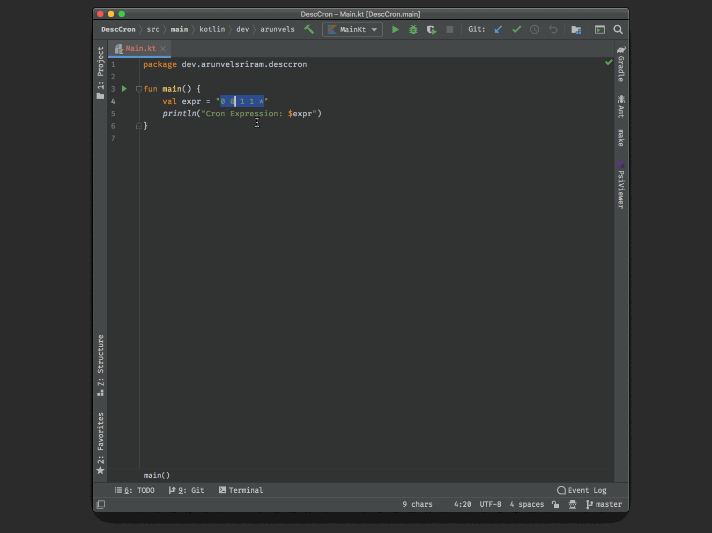

# DescCron

DescCron (Describe Cron) is a plugin for [JetBrains IDEs](https://www.jetbrains.com/products.html#type=ide), that provides a descriptive view of cron expressions for humans.

It's file format agnostic, as the cron expression to be described is a user selected text.



## How to use?

### Popup Menu

* Select the cron expression
* Select DescCron from the Popup Menu

### Keyboard Shortcut

* Select the cron expression
* Use the default keybinding:
    * Mac: ⌘ ⇧ D, C
    * Windows / Linux: ⌃ ⇧ D, C

## Development

```bash
./gradlew clean build
```
