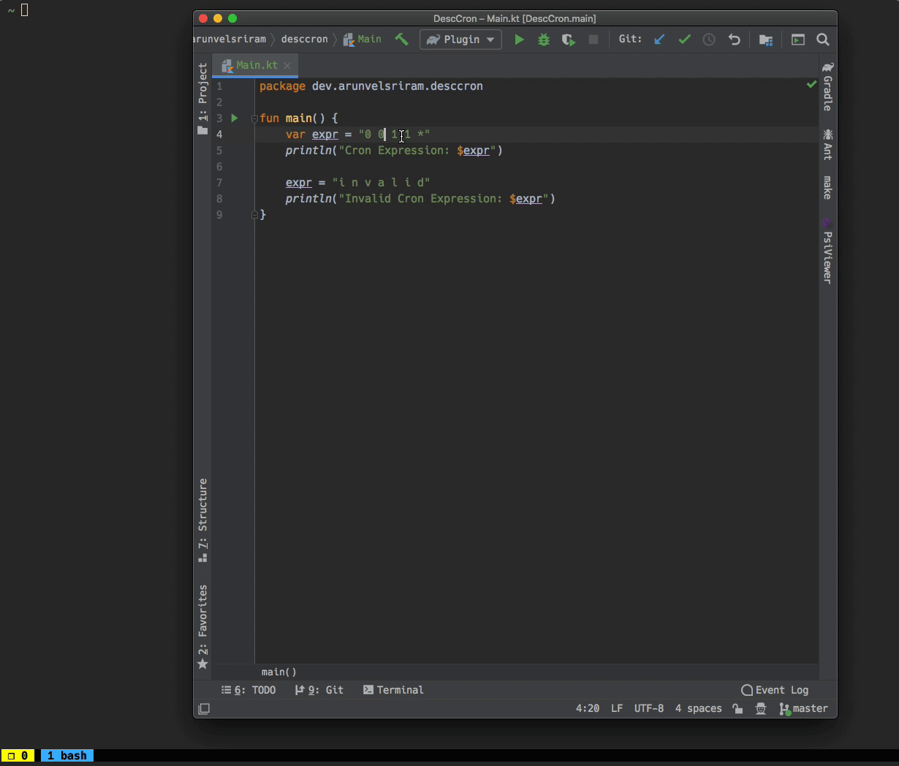

# DescCron

DescCron (Describe Cron) is a plugin for [JetBrains IDEs](https://www.jetbrains.com/products.html#type=ide), that provides a descriptive view of cron expressions for humans.

It's file format agnostic, as the cron expression to be described is a user selected text.



[Plugin Homepage](https://plugins.jetbrains.com/plugin/14159-desccron)

## How to use?

### Popup Menu

* Highlight the cron expression
* Use the options under DescCron group from the Popup Menu

### Keyboard Shortcut

* Highlight the cron expression
* Use the default keybindings:

#### Mac OS X

|Action   |Keybinding|
|:-------:|:--------:|
|Describe |⌘ ⇧ D, C |
|Next Run |⌘ ⇧ D, N |

#### Linux / Windows
|Action    |Keybinding  |
|:--------:|:----------:|
|Describe  |⌃ ⇧ D, C    |
|Next Run  |⌃ ⇧ D, N    |

## Development

```bash
./gradlew clean build
```

## Load the local plugin in IntelliJ for testing

1) Create the plugin archive using `./gradlew clean build`
2) You can find the archive at `build/distributions/DescCron-*.zip`
3) Follow steps from [here](https://www.jetbrains.com/help/idea/managing-plugins.html#install_plugin_from_disk) to install plugin from disk
